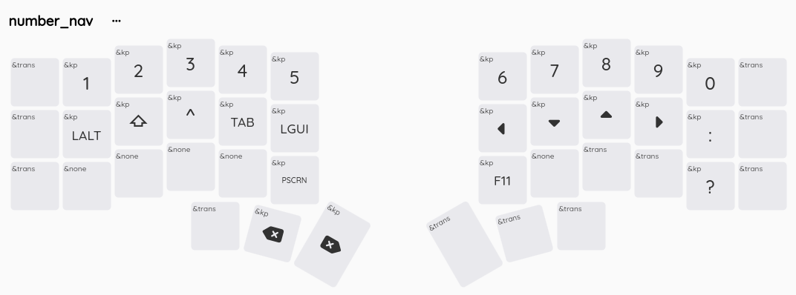
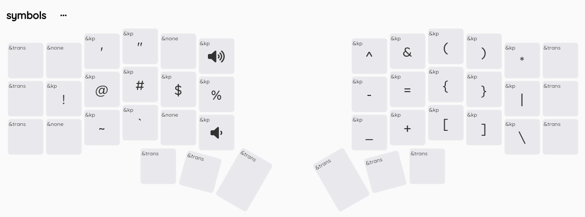
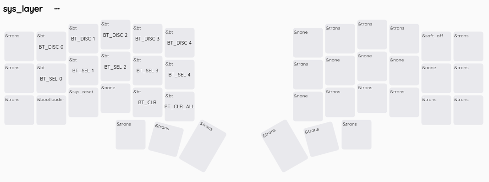

# Corne ZMK 5 columns

ZMK Corne for Super Mini / Promicro Wireless NRF52840.

ZMK Keymap Editor https://nickcoutsos.github.io/keymap-editor/

## How

- Push changes to github
- Github will run actions to build the firmware
- Download the firmware (.uf2)
- Connect board to USB
- Press reset button twice, board will enter bootloader and mounted as media
- Install the firmware to board

## Base Layer

## Number & Nav Layer

## Symbols & Media Layer

## System Layer

